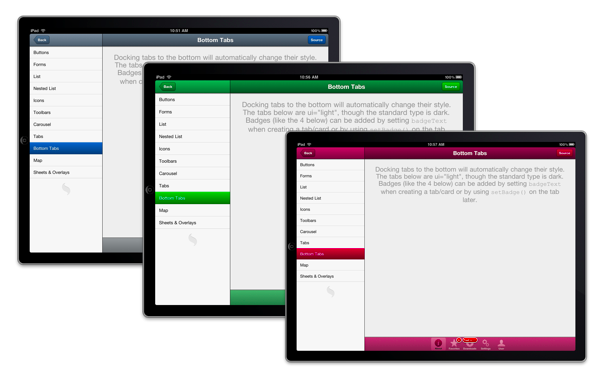
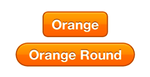
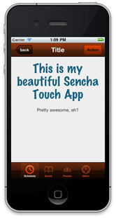
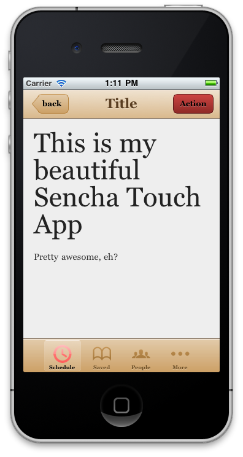
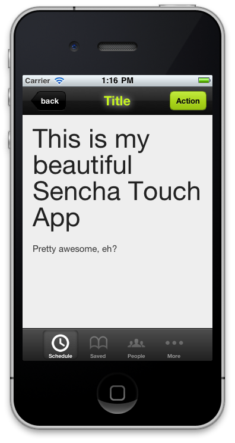

# Theming
______________________________________________

With Ext JS 4 we’ve built on our experience with Sencha Touch to make the framework more themable than ever before by unlocking the power of SASS and Compass. Every aspect of the framework’s appearance can be customized, often by simply tweaking a color variable.

<iframe src="http://player.vimeo.com/video/19159630?byline=0" width="500" height="281" frameborder="0"></iframe>

Sencha Touch has introduced a revolutionary new theming system, built on SASS and Compass, that allows you to create versions of our base theme custom tailored to your application and brand. Because Sencha Touch is built on web standards and targets WebKit, developers are free to use the wide variety of CSS3 properties already available to the platform, like border-radius, background gradients, and even more advanced properties like the CSS3 flexible box model. To create a custom variant of the bundled theme that uses SASS and Compass is very straight-forward as well.

(original article http://www.sencha.com/blog/an-introduction-to-theming-sencha-touch/)

## A Brief Introduction to SASS & Compass

<iframe src="http://player.vimeo.com/video/18084338?byline=0" width="500" height="281" frameborder="0"></iframe>

SASS is a pre-processor which adds new syntax to CSS allowing for things like variables, mixins, nesting, and math/color functions. For example, in SASS we can write:

    $blue: #3bbfce;
    $margin: 16px;
 
    .content-navigation {
        border-color: $blue;
        color: darken($blue, 9%);
    }
 
    .border {
        padding: $margin / 2;
        margin: $margin / 2;
        border-color: $blue;
    }
 
And it will compile to:

    .content-navigation {
        border-color: #3bbfce;
        color: #2b9eab;
    }
 
    .border {
        padding: 8px;
        margin: 8px;
        border-color: #3bbfce;
    }
 
To see the wide variety of other features available in SASS, please see http://sass-lang.com/. Compass extends SASS by adding a variety of CSS3 mixins and providing the extension system that Sencha Touch leverages. With Compass, one can include rules like:

    $boxheight: 10em;
 
    .mybox {
        @include border-radius($boxheight/4);
    }
 
Which compiles into:

    .mybox {
        -webkit-border-radius: 2.5em;
        -moz-border-radius: 2.5em;
        -o-border-radius: 2.5em;
        -ms-border-radius: 2.5em;
        -khtml-border-radius: 2.5em;
        border-radius: 2.5em;
    }
 
You can learn more about the pre-included mixins with Compass and the other tools which it provides here: http://compass-style.org/docs/. I’ve only really touched the surface of what’s possible with these technologies, so I can focus on our use of them in Sencha Touch, but I highly encourage you to briefly look at their respective sites to get a better sense of their capabilities. Now, though, let’s look at setting up a SASS/Compass environment where we can create custom Sencha Touch themes.

## Setting Up Custom Stylesheets
First, we’ll need to make sure we have SASS and Compass installed. Because these technologies are based on Ruby, Windows users will need to install Ruby and RubyGems (these come pre-bundled on Macs). Because SASS is bundled with Compass, you can install both with the following Terminal command:

  gem install compass

Note: You may need to install using “sudo gem install…” for administrative privileges.

Once everything is installed, we’ll need to create a new directory in our project to house our new SASS stylesheets. I typically use resources/scss (SCSS is the syntax language for SASS, and stands for “Sassy CSS”). Within the directory, we’ll create two files, config.rb and application.scss.

__config.rb__ The config.rb is written in Ruby, and is very straight-forward to set up (so don’t worry if you don’t know Ruby). The file is typically a set-it-and-forget-it:

    # Delineate the directory for our SASS/SCSS files (this directory)
    sass_path = File.dirname(__FILE__)
 
    # Delineate the CSS directory (under resources/css in this demo)
    css_path = File.join(sass_path, "..", "css")
 
    # Delinate the images directory
    images_dir = File.join(sass_path, "..", "img")
 
    # Load the sencha-touch framework
    load File.join(sass_path, '..', '..', '..', '..', 'resources', 'themes')
 
    # Specify the output style/environment
    output_style = :compressed
    environment = :production
 
If you are debugging your custom stylesheet, you may also want to set your output_style to “:expanded,” which will compile your CSS line-by-line and actually show, with comments, where the rules are being generated in your SCSS. “:compressed,” as shown above, compacts all of your CSS to one line and removes any comments/extraneous spaces — which is ideal for minimizing footprint in production environments.

__application.scss__ The application.scss file is written in SCSS and has the following structure (we’ll go over what some of these terms mean in a moment):

    // 1. Variable overrides, example:
    // $base-color: #af2584;
 
    // 2. Include Sencha Touch styles
    @import 'sencha-touch/default/all';
    @include sencha-panel;
    @include sencha-buttons;
    @include sencha-sheet;
    @include sencha-picker;
    @include sencha-toolbar-forms;
    @include sencha-tabs;
    @include sencha-toolbar;
    @include sencha-carousel;
    @include sencha-indexbar;
    @include sencha-list;
    @include sencha-layout;
    @include sencha-form;
    @include sencha-loading-spinner;
 
    // 3. Define custom styles (can use SASS/Compass), example:
    // .mybox {
    //     @include border-radius(4px);
    // }
 
As you can see, the main gist of this is that we are importing styles from Sencha Touch, component by component. The area above (1) is where we can actually override variables used by the default Sencha Touch theme to change the output when the actually stylesheets are created/included. There are currently about 50 variables available to override, though we’ll just focus on a few key ones in this article.

## Sencha Touch Variables
__$base-color__ Perhaps the easiest way to create a sweeping change in your app’s design, you can change the $base-color to drastically alter the appearance of all components. The screenshots above demonstrate how the UI changes by simply altering the $base-color.

Other global color variables include $alert-color (red by default), $confirm-color (green by default), $active-color (a saturated version of $base-color, blue by default).

__$base_gradient__ Similar to $base-color, $base-gradient allows you to drastically change the appearance of your app by modifying the gradient style of all elements like buttons, toolbars, and tabbars. The four included values for gradients are ‘matte’, ‘bevel’, ‘glossy’, ‘recessed’, and ‘flat’.

## Custom Styles & Sencha Touch Mixins
In our application.scss shown above, you will notice there is a specific area (3) for custom styles, after we’ve imported the library stylesheets. This is your area to write your application’s custom CSS, and make use of any mixins provided by Sencha Touch. Some common mixins provided by Sencha Touch allow you to embed extra icons in your application and create custom “ui” styles to apply to buttons, toolbars, or tabbars.

__@include pictos-iconmask($name)__ This allows you to embed a custom icon mask for use in buttons or tabs. There are over 300 icons that you can include in your application, thanks to Drew Wilson’s fine Pictos set. All of the icons are base64 encoded into your CSS to cut down on server requests, which is useful in the mobile context. The icons can be found in the Sencha Touch distribution under resources/themes/images/default/pictos/. To include a new icon, simply pass the name of the icon you want, minus the .png extension:

    @include pictos-iconmask(‘wifi’);
 
You can then use it in your application like so:

    var btn = new Ext.Button({
        iconMask: true,
        iconCls: 'wifi'
    });
 
__@include sencha-button-ui($ui-label, $color, $gradient)__ By default, Sencha Touch comes with a variety of button colors and forms, but sometimes you may want another color option for alternative actions. This mixin creates a button UI with the color/gradient specified in the corresponding variables. In addition, this mixin also generates ‘{your-ui-name}-round’ and ‘{your-ui-name}-small’. The text color and shading will be automatically calculated from the background color. Likewise, there are mixins for sencha-toolbar-ui, and sencha-tabbar-ui.

    @include sencha-button-ui('orange', #ff8000, 'glossy');
    And then use in your JavaScript:

    var glossy_orange_btn = new Ext.Button({
        ui: 'orange',
        text: 'Orange'
    });
 
    var round_glossy_orange_btn = new Ext.Button({
        ui: 'orange-round',
        text: 'Orange Round'
    });

## Compiling Our Stylesheet & Adding to Our Application
To compile our stylesheet, we simply run the command “compass compile” in the Terminal from within the scss directory. This command will automatically look for the config.rb, and take care of compiling the CSS into the proper directory.

When you add the stylesheet to your HTML file, don’t forget to remove the included sencha-touch.css — as you’re newly compiled stylesheet includes all of the framework styles as well.

## Some Sample Stylesheets

### Demo #1

    $base-color: #7A1E08;
    $base-gradient: 'glossy';
 
    @import 'sencha-touch/default/all';
 
    @include sencha-panel;
    @include sencha-buttons;
    @include sencha-sheet;
    @include sencha-picker;
    @include sencha-toolbar-forms;
    @include sencha-tabs;
    @include sencha-toolbar;
    @include sencha-carousel;
    @include sencha-indexbar;
    @include sencha-list;
    @include sencha-layout;
    @include sencha-form;
    @include sencha-loading-spinner;
 

 
### Demo #2

    $body-bg-color: #fbf5e6;
    $base-color: #efe1d0;
    $active-color: #aa3030;
 
    @import 'sencha-touch/default/all';
    @include sencha-panel;
    @include sencha-buttons;
    @include sencha-sheet; 
    @include sencha-picker;
    @include sencha-toolbar-forms;
    @include sencha-tabs;
    @include sencha-toolbar;
    @include sencha-carousel;
    @include sencha-indexbar;
    @include sencha-list;
    @include sencha-layout;
    @include sencha-form;
    @include sencha-sheet;
 
    body {
        font-family: Georgia;
        color: #5a3d23;
    }
 
    .x-toolbar .x-toolbar-title {
        color: #5a3d23;
    }

 
### Demo #3

    $body-bg-color: #000;
 
    $base-color: #333;
    $base-gradient: 'matte';
    $active-color: #B2DF1E;
 
    $tabs-dark: $base-color;
    $tabs-light: #555;
 
    $tabs-bottom-radius: .4em;
    $tabs-bottom-gradient: 'bevel';
    $tabs-bar-gradient: 'matte';
    $tabs-bottom-active-gradient: 'recessed';
 
    $toolbar-gradient: 'glossy';
 
    @import 'sencha-touch/default/all';
    @include sencha-panel;
    @include sencha-buttons;
    @include sencha-sheet; 
    @include sencha-picker;
    @include sencha-toolbar-forms;
    @include sencha-tabs;
    @include sencha-toolbar;
    @include sencha-carousel;
    @include sencha-indexbar;
    @include sencha-list;
    @include sencha-layout;
    @include sencha-form;
    @include sencha-sheet;
 
    .x-toolbar .x-toolbar-title {
        color: saturate(lighten($active-color, 10%), 20%);
        text-shadow: rgba(#fff, .8) 0 1px 20px;
    }
 
    .x-tab-active img {
        background: white none !important;
    }
 
    .x-tabbar.x-docked-bottom .x-tab {
        &amp;.x-tab-active {
            -webkit-box-shadow: inset rgba(#000, .8) 0 0 5px !important;
        }
    }

### Next Steps & Extended Resources
We’ve really just touched on the power of theming in Sencha Touch, but already, with just a few small changes, we have radically changed the style of the base Sencha Touch theme. For other great examples of custom stylesheets, look at the Kiva and GeoCongress demos bundled with Sencha Touch. Also be sure to look out for my second article on the subject, “Optimizing Sencha Touch Themes,” where I show how we can take a full-fledged application and reduce the included CSS to under 50kb (with base64 encoded icons!).
